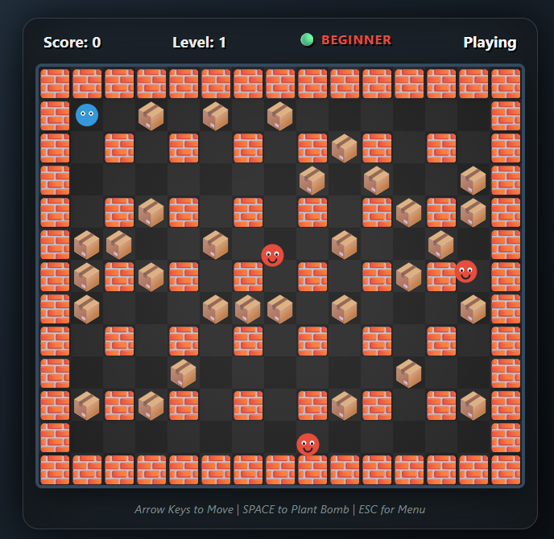

# Bomber Laci 💣


**A modern, web-based Bomberman clone built with Vanilla JS and HTML5 Canvas.**  
Experience the classic arcade excitement with a responsive design, custom audio engine, and smart AI enemies.

## [🕹️ Play the Demo](https://bomberlaci.netlify.app/)

---

## ✨ Features

*   **Custom Engine**: Built from scratch using the HTML5 Canvas API for maximum control and performance.
*   **Modular Architecture**: Clean, modern ES6 codebase organized into core systems, entities, and world management.
*   **Fully Responsive**: Adaptive layout that scales from desktop monitors to mobile phones. Includes a custom virtual D-Pad and Action buttons for touch devices.
*   **Robust Audio System**: Implements the Web Audio API with overlapping SFX, looping BGM, and separate volume/mute controls.
*   **Dynamic Gameplay**:
    *   **3 Difficulty Levels**: Beginner, Advanced, and Pro modes affecting Enemy Speed and AI behavior.
    *   **Smart AI**: Pro enemies track the player using pathfinding logic.
*   **Classic Mechanics**:
    *   Destructible environment (Soft Walls).
    *   **Power-ups**: 💥 Range Up, 💣 Extra Bomb, ✋ Bomb Kick/Push.

## 🎮 How to Play

### Controls

| Action | Desktop (Keyboard) | Mobile (Touch) |
| :--- | :--- | :--- |
| **Move** | `Arrow Keys` | On-screen **D-Pad** |
| **Place Bomb** | `Spacebar` | 🔴 **Bomb Button** |
| **Menu / Pause** | `ESC` | UI Buttons |

### Objective
1.  Place bombs to destroy soft walls and find power-ups.
2.  Trapped enemies? Blast them to clear the stage!
3.  Defeat all enemies to advance to the next level.
4.  Don't get caught in your own explosions!

## 🛠️ Tech Stack

*   **Core**: HTML5, CSS3, Vanilla JavaScript (ES6 Modules).
*   **Rendering**: HTML5 Canvas (2D Context).
*   **Audio**: Web Audio API (No external libraries).
*   **No Frameworks**: Pure, dependency-free implementation.

## 🚀 Local Development

To run this project locally, you'll need a local web server because it uses **ES6 Modules** (which are blocked by CORS policies when opening files directly).

1.  **Clone the repository:**
    ```bash
    git clone https://github.com/sanyi9305/bomberlaci.git
    cd bomberlaci
    ```

2.  **Run with a local server:**

    *   **VS Code**: Install the "Live Server" extension and click "Go Live".
    *   **Python**:
        ```bash
        # Python 3
        python -m http.server 8000
        ```
    *   **Node.js**:
        ```bash
        npx http-server .
        ```

3.  Open your browser and navigate to `http://localhost:8000`.

## 📂 Project Structure

```text
BomberLaci/
├── index.html          # Entry point and UI structure
├── style.css           # Desktop styles and Glassmorphism UI
├── mobile.css          # Mobile-specific responsive overrides
├── assets/             # Images and Sound files
│   ├── images/
│   └── sounds/
└── js/                 # Source Code
    ├── main.js         # Application bootstrapper
    ├── core/           # Core engine systems
    │   ├── Game.js         # Main game loop and state management
    │   ├── AudioManager.js # Sound engine
    │   ├── InputHandler.js # Keyboard and Touch input
    │   ├── UIManager.js    # DOM manipulation
    │   ├── Constants.js    # Configuration and Assets
    │   └── Utils.js        # Helpers (Collision, Math)
    ├── entities/       # Game Objects
    │   ├── Player.js
    │   ├── Enemy.js
    │   ├── Bomb.js
    │   └── ...
    └── world/          # Map generation and rendering
        └── Map.js
```

## Credits

*   **Creator**: [Bodnár Sándor]
*   **Art & Assets**: Custom pixel art and sound effects generated for this project.

---

*Enjoy the game! 💣*
